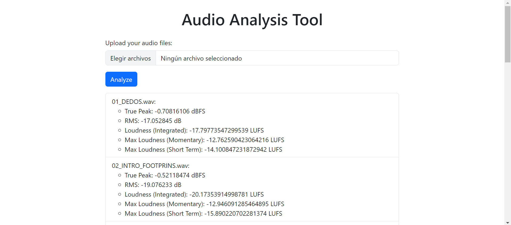

# Audio Analysis Tool

## Descripción del Proyecto
El proyecto **Audio Analysis Tool** es una aplicación web desarrollada con Flask, diseñada para proporcionar herramientas de análisis de audio necesarias para la masterización de música. Este programa permite a los usuarios cargar archivos de audio (en formatos WAV y MP3) y obtener varias métricas importantes como el True Peak, RMS, Loudness Integrado, y los valores máximos de Loudness Momentáneo y a Corto Plazo.

## Características
- Análisis de True Peak en dBFS.
- Cálculo de RMS en dB.
- Medición de Loudness Integrado en LUFS.
- Determinación de los valores máximos de Loudness Momentáneo y a Corto Plazo en LUFS.
- Soporte para múltiples archivos de audio simultáneamente.

## Requisitos del Sistema
- Python 3.7 o superior
- pip (el gestor de paquetes de Python)

## Instalación y Configuración

### Windows

1. **Descargar y descomprimir el proyecto**:
   - Descarga el repositorio del proyecto desde GitHub.
   - Descomprime el archivo en una ubicación de tu elección.

2. **Crear y activar un entorno virtual**:
   - Abre una terminal de comandos (cmd) y navega al directorio del proyecto.
   - Ejecuta los siguientes comandos:
     ```sh
     python -m venv env
     env\Scripts\activate
     ```

3. **Instalar las dependencias**:
   - Con el entorno virtual activado, instala las dependencias necesarias:
     ```sh
     pip install -r requirements.txt
     ```

4. **Ejecutar la aplicación**:
   - Una vez instaladas las dependencias, inicia la aplicación Flask:
     ```sh
     python app.py
     ```

5. **Abrir la aplicación en el navegador**:
   - Abre tu navegador y navega a `http://127.0.0.1:5000` para utilizar la herramienta de análisis de audio.

### Mac

1. **Descargar y descomprimir el proyecto**:
   - Descarga el repositorio del proyecto desde GitHub.
   - Descomprime el archivo en una ubicación de tu elección.

2. **Crear y activar un entorno virtual**:
   - Abre una terminal y navega al directorio del proyecto.
   - Ejecuta los siguientes comandos:
     ```sh
     python3 -m venv env
     source env/bin/activate
     ```

3. **Instalar las dependencias**:
   - Con el entorno virtual activado, instala las dependencias necesarias:
     ```sh
     pip install -r requirements.txt
     ```

4. **Ejecutar la aplicación**:
   - Una vez instaladas las dependencias, inicia la aplicación Flask:
     ```sh
     python app.py
     ```

5. **Abrir la aplicación en el navegador**:
   - Abre tu navegador y navega a `http://127.0.0.1:5000` para utilizar la herramienta de análisis de audio.

## Uso de la Aplicación
1. **Subir archivos de audio**:
   - Utiliza el formulario en la página principal para cargar uno o varios archivos de audio en formato WAV o MP3.

2. **Ver los resultados**:
   - La aplicación procesará los archivos y mostrará los resultados de análisis para cada archivo, incluyendo True Peak, RMS, Loudness Integrado, y los valores máximos de Loudness Momentáneo y a Corto Plazo.

## Pantallazo de la Aplicación


## Contribuciones
Las contribuciones son bienvenidas. Si deseas contribuir al proyecto, por favor sigue estos pasos:
1. Haz un fork del repositorio.
2. Crea una rama con una nueva característica (`git checkout -b feature/nueva-caracteristica`).
3. Realiza los commits necesarios (`git commit -am 'Añadir nueva característica'`).
4. Haz push a la rama (`git push origin feature/nueva-caracteristica`).
5. Abre un Pull Request.

## Licencia
Este proyecto está licenciado bajo la Licencia MIT. Consulta el archivo `LICENSE` para obtener más detalles.

---

Desarrollado por [José Mercado].

## Contacto
Sígueme en Instagram: [josemercado.music](https://www.instagram.com/josemercado.music)
